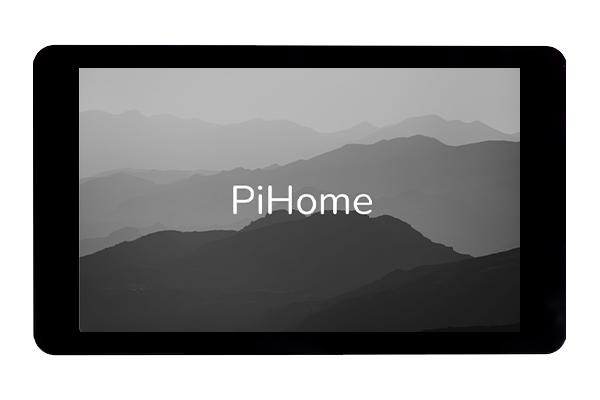
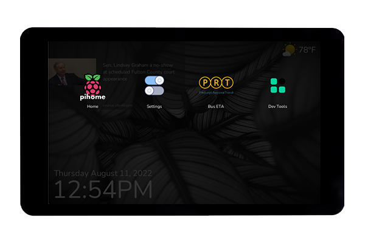
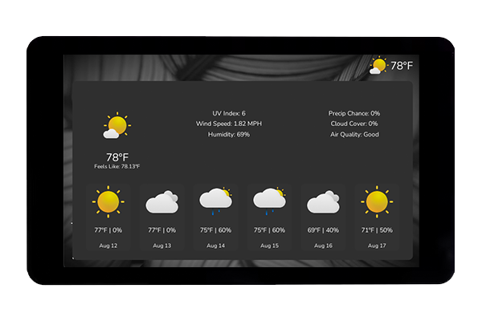
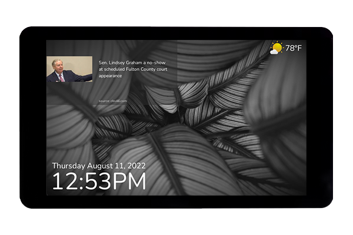

# PIHOME




PiHome is an open source ("for fun") project that I've been working on.  PiHome has no microphone, camera, or big tech company backend collecting data.  It's simply a home kiosk/informational and control panel to replace (and potentially do more than) products like the Amazon Echo, Google Home, etc.  

In it's current state, PiHome has a Home Screen that displays current time, weather via location information and tomorrow.io API and a settings panel.  Additionally, it has a "custom screen" I've built for public transportation information - upcoming bus departure times.

### Custom Screens

To create a custom screen, create subdirectory within the `screens` directory that is typically named whatever your screen ("PiHome app") is and within your directory, create two files named `<yourapp.py>` and `<yourapp.kv>`.  The `py` file contains business logic for your application while the `kv` file contains UI markdown.  Please refer to the Kivy documentation for more information on this.  Your `py` file should extend the `PiHomeScreen` (refer to other screens in this directory as an example).  `PiHomeScreen` provides a few properties that can be overriden that PiHome will use.  For example, a default name and icon.    You can set these to whatever you like. To add your screen to PiHome, go into the `main.py` and find the `screens` array initialization in the `setup()` funciton.  Simply add your screen to the array.  When you spin up PiHome via `python3 main.py`, long press the display (current geasture may change) to access the App menu.  You should see your new screen ("app") in the menu selection and upon clicking, you will be sent into your screen.    Long press again to get the app menu and return home.  The App Menu is accessible from anywhere.




### Settings/Configuration 

API Configurations, Weather, Wallpaper, and News can be configured from the Settings screen.  Also available in the App menu.




### News Sources
News sources are currently only subreddits. You can enable or disable news.  When enabled, the current hot posts from the subreddit(s) configured will be displayed in the upper left corner.  You do not have to select an actual news subreddit.  If you pick `/r/aww` for example, photos will be displayed instead of text posts.


 
### Wallpaper
By default, PiHome will display wallpapers from the PiHome CDN (https://pihome.io).  You can configure this to be a Custom Image URL that is static, Current "hot" posts from the subreddit of your choice (defaults to /r/wallpapers), or a Wallhaven search (defaults to landscapes).  If Wallhaven or Reddit wallpaper sources are selected, the background will periodically change, alternating through the latest wallpapers available. 

### MQTT Services
MQTT services are also available.  You can connect your PiHome to an MQTT services of your choice (I use Adafruit.io) and send custom information from external services such as IFTTT, your own scripts, etc. (See MQTT section below for payload information).


> This is a hobby project that I hope may be useful to others.  Although currently not very exciting, https://pihome.io is the official site for the project.  Python is not my day to day language, I'm sure some of the syntax and coding styles are not up to standard.  This is also a learning project for myself.  Please feel free to open issues or pull requests. 


---


### Requirements:

- [Raspberry Pi 3+](https://www.raspberrypi.com/products/raspberry-pi-4-model-b/)
- [Official 7" LCD Touch Screen](https://www.raspberrypi.com/products/raspberry-pi-touch-display/)
- [Raspberry  PI  OS Lite (No Desktop Environment)](https://www.raspberrypi.com/software/)

### Installation

- Install RaspPI Lite OS
- Setup Wifi through RaspPi setup tools
- Optionally set your raspberry pi os to bypass login via `raspi-config`
- Install PiHome with:

```
curl -sSL https://pihome.io/install | bash
```


### MQTT Payload Definitions

If configured, PiHome can subscribe to MQTT feeds and react to events. 

Three types of events can be sent to PiHome

- Notification.  A notification will appear on screen until dismissed
- Display.  A display will be a full screen UI overlay
- App Trigger.  This event will trigger an app, if it exists, in PiHome.  For example, if you would like an uber app to be triggered when an event is pushed
to the MQTT feed

The payloads for these events should respect the following.

Notification
```json
{
    "type": "notificaiton",
    "color": "<(r,g,b,a)>",
    "icon": "<icon_url>",
    "title": "<title>",
    "message": "<message>"
}
```

Display
```json
{
    "type": "display",
    "background": "<(r,g,b,a)>", // Optional
    "title": "<title>",
    "message": "<message>",
    "image": "<image_url>",
    "timeout": "<seconds>" // Optional
}
```

Display Image
```json
{
    "type": "image", 
    "image_url": "<image_src_url>", 
    "timeout": "seconds", // Optional 
    "reload_interval": "<seconds" // Optional
}
```

App Trigger
```json
{
    "type": "app",
    "key": "<app key>" // Not app name!  The key should match the key from the screens array in main.py:setup()
}
```