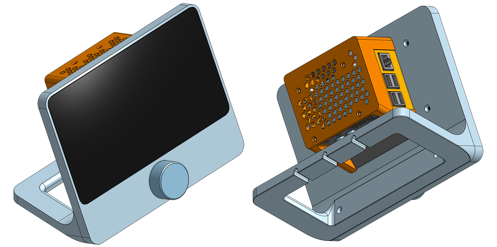

# PIHOME


PiHome is an open source ("for fun") project that I've been working on.  PiHome has no microphone, camera, or big tech company backend collecting data.  It's simply a home kiosk/informational and control panel to replace (and potentially do more than) products like the Amazon Echo, Google Home, etc.  

In it's current state, PiHome has a Home Screen that displays current time, weather via location information and tomorrow.io API and a settings panel.  Additionally, it has a "custom screen" I've built for public transportation information - upcoming bus departure times.



Although not required, PiHome is designed to work with a rotary encoder/knob controls.  Each screen is responsible for overriding default behavior for the rotary encoder (currently audio controls), so if you develop your own screens, please consider making use of this.  All default pihome functionality will work without the rotary encoder.  I have 3D printed a custom case for PiHome and the *.3MF can be found in the `./3dprint` directory of this repository.  There is also a README in that directory with more information on setting up the rotary encoder hardware.  The 3D Print/Models are adapted for pihome from the plexamp-pi project by Paul Arden.  Please see the plexamp-pi project on github for more information: https://github.com/ardenpm/plexamp-pi


### Custom Screens

To create a custom screen, create subdirectory within the `screens` directory that is typically named whatever your screen ("PiHome app") is and within your directory, create two files named `<yourapp.py>` and `<yourapp.kv>`.  The `py` file contains business logic for your application while the `kv` file contains UI markdown.  Please refer to the Kivy documentation for more information on this.  Your `py` file should extend the `PiHomeScreen` (refer to other screens in this directory as an example).  `PiHomeScreen` provides a few properties that can be overriden that PiHome will use.  For example, a default name and icon.  PiHome will automatically find and load any screens in the `screens` directory that includes a `manifest.json` file.  The `manifest.json` file should contain metadata about how the screen should be loaded. 

Example `manifest.json`:
```json
{
    "module": "NewYearsEve.newyearseve", // This is the subdirectory and file name of the screen.  The path is /screens/NewYearsEven/newyearseve.py
    "name": "NewYearsEveScreen",  // The name of the screen. IMPORTANT:  This must match the class name in the py file
    "id": "nye", // This can be anything you want as long as it is unique among all other screens
    "label": "New Years!", // This is the label that will appear in the app menu
    "description": "", // Currently unused
    "hidden": false, // If this is true, the screen will be loaded into pihome but not accessible.  This is useful if you're creating a custom event that needs to trigger the screen but shouldn't be accessible otherwise
    "requires_pin": false, // If this is set to true, you'll be prompted to enter your pin.  Your pin is configured in the settings screen
    "index": 4 // This is the order in which the screen will appear in the app menu.  If it is unset, apps will be rendered in whatever order they were found in the filesystem.  Currently, the only screen that has an index is the home screen and it is set to 0 to ensure it is always the first screen
}
```

### Custom Events

To leverage full power of PiHome, you can create custom events that do various things.  PiHome comes with a series of default events that you can refer to.  To create a custom event, add a new event into the `events` directory.  The event should be a python file that extends the `PiHomeEvent` class.  The `PiHomeEvent` class provides a few properties that can be overriden that PiHome will use.  For example, a default name and icon.  PiHome will automatically find and load any events in the `events` directory.   Events are triggered by MQTT messages or webhooks.  The payload of the message should contain a `type` key that matches the type of the event.  The rest of the payload can be whatever you like and will be passed into the constructor of your event.  

The `execute()` function is what should happen when the event gets triggered.  For example, if you have created a custom screen from the previous section that is set to hidden (for example, some sort of notification screen), you can pass the payload properties to that screen and display it through the PIHOME_SCREEN_MANAGER - Which you can access from anywhere. 


### Settings/Configuration 

API Configurations, Weather, Wallpaper, and News can be configured from the Settings screen.  Also available in the App menu.


### News Sources
News sources are currently only subreddits. You can enable or disable news.  When enabled, the current hot posts from the subreddit(s) configured will be displayed in the upper left corner.  You do not have to select an actual news subreddit.  If you pick `/r/aww` for example, photos will be displayed instead of text posts.


 
### Wallpaper
By default, PiHome will display wallpapers from the PiHome CDN (https://pihome.io).  You can configure this to be a Custom Image URL that is static, Current "hot" posts from the subreddit of your choice (defaults to /r/wallpapers), or a Wallhaven search (defaults to landscapes).  If Wallhaven or Reddit wallpaper sources are selected, the background will periodically change, alternating through the latest wallpapers available. 

### MQTT Services
MQTT services are also available.  You can connect your PiHome to an MQTT services of your choice (I use Adafruit.io) and send custom information from external services such as IFTTT, your own scripts, etc. (See MQTT section below for payload information).


> This is a hobby project that I hope may be useful to others.  Although currently not very exciting, https://pihome.io is the official site for the project.  Python is not my day to day language, I'm sure some of the syntax and coding styles are not up to standard.  This is also a learning project for myself.  Please feel free to open issues or pull requests. 


---


### Requirements:

- [Raspberry Pi 3+](https://www.raspberrypi.com/products/raspberry-pi-4-model-b/)
- [Official 7" LCD Touch Screen](https://www.raspberrypi.com/products/raspberry-pi-touch-display/)
- [Raspberry  PI  OS Lite (No Desktop Environment)](https://www.raspberrypi.com/software/)

### Installation

- Install RaspPI Lite OS
- Setup Wifi through RaspPi setup tools
- Optionally set your raspberry pi os to bypass login via `raspi-config`
- Install PiHome with:

```
curl -sSL https://pihome.io/install | bash
```

### Timers

### The Task Manager and Tasks


### PiHome Events

If configured, PiHome can subscribe to MQTT feeds and react to events.  These payloads can also be posted to pihome via a webhook that looks like
```json
{
    "webhook": {
        // Your payload here
    }
}
```


Display
Shows a message on the screen. 
```json
{
    "type": "display",
    "background": "<(r,g,b,a)>", // Optional
    "title": "<title>",
    "message": "<message>",
    "image": "<image_url>",
    "timeout": "<seconds>" // Optional
}
```

Display Image
Shows an image on the screen
```json
{
    "type": "image", 
    "image_url": "<image_src_url>", 
    "timeout": "seconds", // Optional 
    "reload_interval": "<seconds>" // Optional
}
```

App Trigger
Triggers an app.  The app key should match the id as described in the manifest.json file for the screen.
```json
{
    "type": "app",
    "key": "<app key>" // Not app name!  The key should match the key from the screens array in main.py:setup()
}
```

Timer
Creates a timer.  The on_complete is optional and can be set to another PiHomeEvent payload.  See The Timer Section for more inforamtion on how timers work.
```json
{
    "webhook": {
            "type": "timer",
            "duration": <TIMER_AMOUNT>, // Number of seconds the timer should run
            "label": "Feed The Dog!", // Label for the timer
            "on_complete": {} // Optioanl PiHome Event triggered when the timer is complete
    }
}
```

Task 
Schedules a new task with the task manager.  See Tasks Section for more information on how Tasks and the TaskManager work.
```json
{
    "webhook": {
        "type": "task",
        "name": "Water the plants!", // Name will be displayed in the task screen
        "description": "Don't forget to water the plants!  They're thirsty too", // Description will be displayed in the task screen
        "start_time": "02/23/2024 7:00", // When should the task be displayed on the screen?  This an be a date in MM/DD/YYYY HH:MM format or a delta in the format of delta:<hours> hours, delta:<days> days, etc
        "priority": 1, // What is the priority of the task?  1 is the lowest, 3 is the highest.  Higher priority tasks will play more annoying sounds
        "repeat_days": 1, // How frequently the task should repeat.  0 for no repeat.  Upon execution, a new task will be created next time the task is due
        "background_image": <URL>, // Optional image url, leave this out if you don't want an image background
        "on_confirm": {}, // Optional PiHome Event When the Confirm Button is Pressed
        "on_cancel": {} // Optional PiHome Event When the Cancel Button is Pressed
    }
}
```