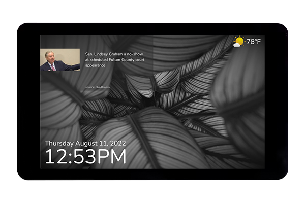
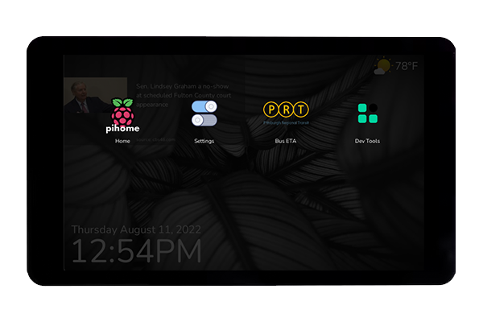
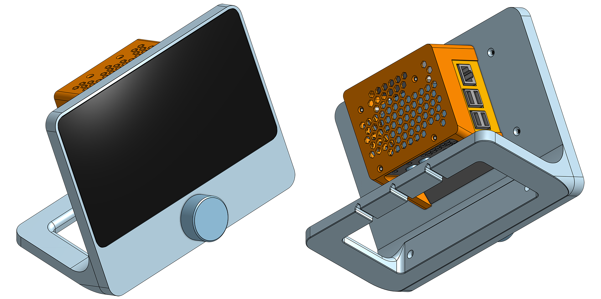
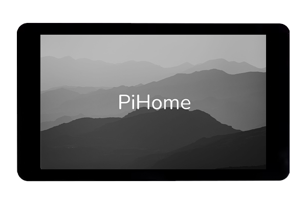
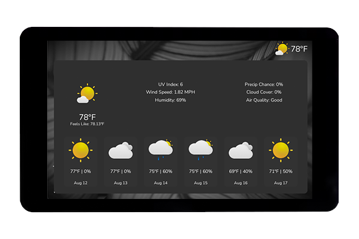

# PiHome



PiHome is an open-source home kiosk and control panel for the Raspberry Pi. It replaces products like Amazon Echo Show and Google Nest Hub without any microphones, cameras pointed at you, or big-tech backends collecting your data. Everything runs locally on your Pi.

PiHome provides a touch-friendly interface on the official 7" Raspberry Pi display with weather, news, wallpapers, music playback, Home Assistant integration, 3D printer monitoring, and more. It's extensible through a manifest-driven screen system and a powerful event/webhook API.

## Features

- **Weather** - Real-time conditions and forecast via Tomorrow.io
- **Dynamic Wallpapers** - Rotate backgrounds from Reddit, Wallhaven, custom URLs, or the PiHome CDN
- **News** - Headlines from configurable Reddit sources
- **Music Player** - Stream audio from URLs, local files, and saved radio stations with album art
- **AirPlay** - Receive audio from Apple devices via shairport-sync
- **Home Assistant** - Monitor and control entities, set up reactive automations
- **3D Printer Monitoring** - BambuLab printer status with live camera feed
- **Spotify** - Playback control and now-playing display
- **Pi-hole** - DNS ad-blocker control panel
- **Timers & Tasks** - Scheduled and event-driven task management
- **Transit Tracker** - Real-time bus departures (Pittsburgh Regional Transit)
- **Cocktail Browser** - Search recipes from TheCocktailDB
- **Whiteboard** - Freehand drawing canvas
- **Control Center** - Up to 8 configurable quick-action buttons that execute shell commands
- **Rotary Encoder** - Optional physical knob for volume, navigation, and per-screen actions
- **Webhook & MQTT API** - Control PiHome from external services like IFTTT, Home Assistant automations, or custom scripts
- **Web Interface** - Progressive Web App for remote access
- **Dark/Light Themes** - Fully configurable color theming



## Requirements

- [Raspberry Pi 3B+ or newer](https://www.raspberrypi.com/products/raspberry-pi-4-model-b/)
- [Official 7" LCD Touch Screen](https://www.raspberrypi.com/products/raspberry-pi-touch-display/) (800x480)
- [Raspberry Pi OS Lite](https://www.raspberrypi.com/software/) (no desktop environment)
- Network connectivity (WiFi or Ethernet)

## Installation

1. Install Raspberry Pi OS Lite and connect to WiFi
2. Optionally configure auto-login via `raspi-config`
3. Run the installer:

```bash
curl -sSL https://pihome.io/install | bash
```

The installer will set up all dependencies, build required libraries, and configure PiHome as a systemd service that starts on boot.

### Installer Options

You can pass flags to customize the installation:

```bash
# Skip AirPlay (shairport-sync) installation
curl -sSL https://pihome.io/install | bash -s -- --skip-airplay

# Run install.sh directly with options
sudo ./setup/install.sh --help
sudo ./setup/install.sh --verbose        # Show command output
sudo ./setup/install.sh --skip-airplay   # Skip AirPlay support
sudo ./setup/install.sh --clean          # Start fresh (ignore previous progress)
```

### Service Management

PiHome runs as a systemd service:

```bash
sudo systemctl start pihome      # Start PiHome
sudo systemctl stop pihome       # Stop PiHome
sudo systemctl restart pihome    # Restart PiHome
sudo systemctl status pihome     # Check status
tail -f /usr/local/PiHome/pihome.log  # View live logs
```

### Updating

```bash
pihome-update    # Pull latest changes from git
```

Or to update and restart in one step:

```bash
cd /usr/local/PiHome && ./update_and_restart.sh
```

## Configuration

PiHome is configured through the Settings screen (PIN-protected) or by editing `base.ini` directly. Configuration sections include:

| Section | Purpose |
|---------|---------|
| `[window]` | Display resolution (default 800x480) |
| `[security]` | PIN code for Settings access |
| `[theme]` | Dark/light mode toggle |
| `[weather]` | Tomorrow.io API key, coordinates |
| `[wallpaper]` | Source (Reddit, Wallhaven, Custom, CDN), subreddits, search terms |
| `[news]` | News source and subreddits |
| `[mqtt]` | Broker host, port, credentials, topic |
| `[audio]` | Audio device selection |
| `[music]` | Discogs API token for album art |
| `[lofi]` | Local audio folder paths and labels |
| `[controlcenter]` | 8 configurable buttons (icon, label, shell command each) |
| `[homeassistant]` | Host URL and long-lived access token |
| `[bambulab]` | Printer IP, access code, serial, camera settings |
| `[spotify]` | Client ID, secret, OAuth tokens |
| `[pihole]` | API key, host IP |
| `[bus]` | Transit API key, routes, stops |
| `[ubereats]` | Session cookie, CSRF token, polling hours |
| `[cocktaildb]` | TheCocktailDB API key |
| `[logging]` | Log level and output path |

## Screens

PiHome uses a manifest-driven screen discovery system. Each screen lives in its own directory under `screens/` and is automatically loaded if it contains a `manifest.json` file.

### Built-in Screens

| Screen | Description |
|--------|-------------|
| **Home** | Clock, weather, news, wallpaper, and control center |
| **Home Assistant** | Entity monitoring and control with device cards |
| **Timers** | Create and manage countdown timers |
| **Task Manager** | View and manage scheduled/event-driven tasks |
| **BambuLab** | 3D printer status, temperatures, and live camera feed |
| **Spotify** | Playback control and now-playing display |
| **Music Player** | Local audio playback with playlists and album art |
| **Pi-hole** | DNS ad-blocker statistics and controls |
| **Bus** | Real-time transit departures (Pittsburgh Regional Transit) |
| **Uber Eats** | Live order tracking |
| **Cocktails** | Recipe search from TheCocktailDB |
| **Whiteboard** | Freehand drawing canvas |
| **Settings** | Configuration panel (PIN-protected) |
| **Dev Tools** | Development and debugging utilities |

### Creating a Custom Screen

1. Create a directory under `screens/` (e.g., `screens/MyScreen/`)
2. Add a `manifest.json` file
3. Create your Python module and Kivy layout file
4. Optionally add an `audio/` subdirectory with `.mp3`, `.wav`, or `.ogg` sound effects (auto-discovered as `myscreen.<filename>`)

#### manifest.json

```json
{
    "module": "MyScreen.myscreen",
    "name": "MyScreenClass",
    "id": "my_screen",
    "label": "My Screen",
    "description": "A custom screen",
    "icon": "https://example.com/icon.png",
    "hidden": false,
    "disabled": false,
    "requires_pin": false,
    "index": 20,
    "settings": [
        {
            "type": "title",
            "title": "My Screen Settings"
        },
        {
            "type": "string",
            "title": "API Key",
            "desc": "Your API key for the service",
            "section": "myscreen",
            "key": "api_key"
        },
        {
            "type": "bool",
            "title": "Enable Feature",
            "desc": "Toggle this feature on or off",
            "section": "myscreen",
            "key": "feature_enabled"
        },
        {
            "type": "options",
            "title": "Display Mode",
            "desc": "Choose how content is displayed",
            "section": "myscreen",
            "key": "display_mode",
            "options": ["Compact", "Full", "Minimal"]
        }
    ]
}
```

**Manifest Fields:**

| Field | Required | Description |
|-------|----------|-------------|
| `module` | Yes | Import path relative to `screens/` (e.g., `MyScreen.myscreen`) |
| `name` | Yes | Class name to instantiate (must match your Python class) |
| `id` | Yes | Unique screen identifier |
| `label` | Yes | Display name in the app menu |
| `description` | No | Metadata description |
| `icon` | No | Icon URL or local path for the app menu |
| `hidden` | No | If `true`, the screen loads but doesn't appear in the app menu (default: `false`) |
| `disabled` | No | If `true`, the screen is not loaded at all (default: `false`) |
| `requires_pin` | No | If `true`, PIN entry is required to access the screen (default: `false`) |
| `index` | No | Sort order in the app menu (lower = first, default: `9999`) |
| `settingsLabel` | No | Override the label shown in the Settings screen |
| `settingsIndex` | No | Sort order in the Settings screen (default: `9999`) |
| `settings` | No | Array of setting definitions (see below) |

**Setting Types:**

| Type | Description |
|------|-------------|
| `title` | Section header (no config value) |
| `string` | Text input |
| `numeric` | Number input |
| `bool` | Toggle switch (stored as `0`/`1`) |
| `options` | Dropdown with predefined choices |

Each setting (except `title`) requires `section` and `key` fields that map to the INI config file.

#### Python Screen

```python
from interface.pihomescreen import PiHomeScreen
from util.configuration import CONFIG
from kivy.clock import Clock

class MyScreenClass(PiHomeScreen):

    def on_enter(self, *args):
        super().on_enter(*args)
        # Called when screen becomes active
        # Start connections, polling, etc.

    def on_pre_leave(self, *args):
        super().on_pre_leave(*args)
        # Called before screen exits
        # Stop connections, clean up

    def on_config_update(self, config):
        # Called when settings change
        api_key = CONFIG.get("myscreen", "api_key", "")
        # Apply new settings...
        super().on_config_update(config)

    def on_rotary_turn(self, direction, button_pressed):
        """Handle rotary encoder turn.

        Args:
            direction: 1 (clockwise) or -1 (counter-clockwise)
            button_pressed: True if the button is held while turning

        Returns:
            True if handled, False to propagate to default behavior (volume)
        """
        return True

    def on_rotary_pressed(self):
        """Handle short press. Return True if handled."""
        return True

    def on_rotary_long_pressed(self):
        """Handle long press. Return True if handled."""
        self.go_back()
        return True
```

**PiHomeScreen Base Class:**

| Method / Property | Description |
|-------------------|-------------|
| `on_enter(*args)` | Screen becomes active |
| `on_pre_leave(*args)` | Screen is about to exit |
| `on_config_update(config)` | Settings were changed |
| `show()` | Navigate to this screen |
| `go_back()` | Navigate to previous screen |
| `on_rotary_turn(direction, pressed)` | Rotary encoder turned (default: volume) |
| `on_rotary_pressed()` | Short press (default: play/pause) |
| `on_rotary_long_pressed()` | Long press (default: stop audio) |
| `on_gesture(gesture_name)` | Touch gesture recognized |
| `is_open` | `True` when screen is displayed |
| `locked` | When `True`, prevents navigation away |
| `bg_color`, `text_color`, `accent_color`, etc. | Theme colors (auto-updated) |

**Key Patterns:**

- Use `threading.Thread(daemon=True)` with `threading.Event()` for background work
- Push UI updates from threads via `Clock.schedule_once(lambda dt: ..., 0)`
- Start connections in `on_enter()`, stop them in `on_pre_leave()`
- Always call `super().on_config_update(config)` at the end of your override

## Events

Events are the core action system in PiHome. They can be triggered via MQTT messages, HTTP webhooks, WebSocket messages, or composed within other events.

### Sending Events

**Via MQTT** - Publish a JSON message to your configured MQTT topic:
```json
{"type": "display", "title": "Hello", "message": "World", "image": "https://example.com/img.png"}
```

**Via HTTP POST** - Send to `http://<pihome-ip>:8989`:
```json
{"type": "display", "title": "Hello", "message": "World", "image": "https://example.com/img.png"}
```

Or wrapped in a webhook envelope:
```json
{"webhook": {"type": "display", "title": "Hello", "message": "World", "image": "https://example.com/img.png"}}
```

**Via WebSocket** - Connect to `ws://<pihome-ip>:8765` and send the same JSON format.

### Event Reference

#### display

Show a fullscreen message with an image.

```json
{
    "type": "display",
    "title": "Package Delivered",
    "message": "Your package has arrived at the front door",
    "image": "https://example.com/package.png",
    "background": [0.2, 0.2, 0.2, 1.0],
    "timeout": 30
}
```

| Field | Required | Description |
|-------|----------|-------------|
| `title` | Yes | Heading text |
| `message` | Yes | Body text |
| `image` | Yes | Image URL |
| `background` | No | RGBA color list or hex string |
| `timeout` | No | Auto-dismiss after N seconds |

#### image

Display a fullscreen image.

```json
{
    "type": "image",
    "image": "https://example.com/photo.jpg",
    "timeout": 60,
    "reload_interval": 10
}
```

| Field | Required | Description |
|-------|----------|-------------|
| `image` | Yes | Image URL |
| `timeout` | No | Auto-dismiss after N seconds |
| `reload_interval` | No | Refresh the image every N seconds |

#### alert

Show a message box with buttons.

```json
{
    "type": "alert",
    "title": "Confirm Action",
    "message": "Are you sure you want to proceed?",
    "timeout": 30,
    "level": 1,
    "buttons": 1,
    "on_yes": {"type": "homeassistant", "entity_id": "switch.garage", "method": "set", "state": "turn_on"},
    "on_no": {"type": "toast", "label": "Cancelled"}
}
```

| Field | Required | Description |
|-------|----------|-------------|
| `title` | Yes | Alert heading |
| `message` | Yes | Alert body |
| `timeout` | Yes | Auto-dismiss after N seconds |
| `level` | No | 0=Error, 1=Warning, 2=Info, 3=Success |
| `buttons` | No | 0=OK only, 1=Yes/No |
| `on_yes` | No | Event to fire on "Yes" (when `buttons: 1`) |
| `on_no` | No | Event to fire on "No" (when `buttons: 1`) |

#### app

Navigate to a screen.

```json
{
    "type": "app",
    "app": "_bambulab"
}
```

| Field | Required | Description |
|-------|----------|-------------|
| `app` | Yes | Screen ID (the `id` field from its manifest) |

#### audio

Control audio playback.

```json
{
    "type": "audio",
    "action": "play_url",
    "value": "https://example.com/stream.mp3"
}
```

| Field | Required | Description |
|-------|----------|-------------|
| `action` | Yes | One of: `play_url`, `play`, `stop`, `volume`, `next`, `prev`, `previous`, `clear_queue`, `save_url`, `save`, `save_current` |
| `value` | No | Parameter for the action (URL, volume level, etc.) |

#### timer

Create a countdown timer.

```json
{
    "type": "timer",
    "label": "Pizza Timer",
    "duration": 900,
    "on_complete": {"type": "alert", "title": "Timer Done", "message": "Pizza is ready!", "timeout": 60}
}
```

| Field | Required | Description |
|-------|----------|-------------|
| `label` | Yes | Timer display name |
| `duration` | Yes | Duration in seconds |
| `on_complete` | No | Event to fire when timer expires |

#### task

Create a scheduled or event-triggered task.

```json
{
    "type": "task",
    "name": "Water the Plants",
    "description": "The garden needs watering",
    "priority": 2,
    "start_time": "03/15/2026 07:00",
    "repeat_days": 1,
    "on_confirm": {"type": "toast", "label": "Task completed!"},
    "background_image": "https://example.com/plants.jpg"
}
```

| Field | Required | Description |
|-------|----------|-------------|
| `name` | Yes | Task display name |
| `description` | Yes | Task details |
| `priority` | Yes | 1=Low, 2=Medium, 3=High (higher = more persistent notifications) |
| `start_time` | No* | `MM/DD/YYYY HH:MM` or delta format: `delta:2 hours`, `delta:3 days` |
| `state_id` | No* | Home Assistant entity ID to trigger on state change |
| `trigger_state` | No | Specific state value that triggers (used with `state_id`) |
| `is_passive` | No | If `true`, don't show popup notification (default: `false`) |
| `repeat_days` | No | Repeat every N days (0 = no repeat) |
| `on_run` | No | Event to fire when task starts |
| `on_confirm` | No | Event to fire when user confirms |
| `on_cancel` | No | Event to fire when user cancels |
| `background_image` | No | Image URL for task display |

\* Either `start_time` or `state_id` is required.

#### homeassistant

Interact with Home Assistant entities.

```json
{
    "type": "homeassistant",
    "entity_id": "light.living_room",
    "method": "set",
    "state": "turn_on",
    "data": "{\"brightness\": 255}"
}
```

| Field | Required | Description |
|-------|----------|-------------|
| `entity_id` | Yes | HA entity ID (e.g., `light.living_room`) |
| `method` | Yes | `set` (call service / set state) or `get` (read state) |
| `state` | No | Service to call (e.g., `turn_on`, `turn_off`) or state to set |
| `data` | No | JSON string of additional service data |

#### hareact

Register a persistent Home Assistant state-change listener that fires a PiHome event.

```json
{
    "type": "hareact",
    "entity_id": "binary_sensor.front_door",
    "state": "on",
    "action": {"type": "display", "title": "Door Opened", "message": "Front door was opened", "image": "https://example.com/door.png", "timeout": 15}
}
```

| Field | Required | Description |
|-------|----------|-------------|
| `entity_id` | Yes | HA entity to watch |
| `action` | Yes | PiHome event to execute when triggered |
| `state` | No | Specific state to react to (omit for any change) |

Returns a `listener_id` that can be used with `remove_hareact` to unregister. Listeners persist across restarts.

#### remove_hareact

Remove a registered HA state-change listener.

```json
{
    "type": "remove_hareact",
    "id": "listener-uuid-here"
}
```

#### command

Execute a registered system command.

```json
{
    "type": "command",
    "execute": "update"
}
```

Available commands: `update`, `soften` (brightness 10%), `brighten` (brightness 100%)

#### shell

Execute a shell command asynchronously.

```json
{
    "type": "shell",
    "command": "curl",
    "args": "-s https://api.example.com/data",
    "on_complete": {"type": "toast", "label": "Result: $1"},
    "on_error": {"type": "alert", "title": "Error", "message": "Command failed: $1", "timeout": 10}
}
```

| Field | Required | Description |
|-------|----------|-------------|
| `command` | Yes | Executable to run |
| `args` | No | Command arguments |
| `on_complete` | No | Event to fire on success (`$1` = stdout) |
| `on_error` | No | Event to fire on failure (`$1` = stdout) |

#### sfx

Play a sound effect.

```json
{
    "type": "sfx",
    "name": "notification",
    "state": "play",
    "loop": false
}
```

| Field | Required | Description |
|-------|----------|-------------|
| `name` | Yes | Sound effect name (use `introspect` to list available) |
| `state` | No | `play` or `stop` (default: `play`) |
| `loop` | No | Loop the sound (default: `false`) |

**Sound effect sources:**

Global sound effects are loaded from `assets/audio/sfx/` and keyed by filename (e.g., `alert.mp3` → `"alert"`).

Screens can also bundle their own sound effects by adding an `audio/` subdirectory. Screen-specific sounds are namespaced as `screendir.filename` (lowercase directory name, no extension):

```
screens/MyScreen/audio/alarm.mp3  →  "myscreen.alarm"
screens/MyScreen/audio/done.wav   →  "myscreen.done"
```

Supported formats: `.mp3`, `.wav`, `.ogg`

#### wallpaper

Control the wallpaper service.

```json
{
    "type": "wallpaper",
    "action": "shuffle"
}
```

| Field | Required | Description |
|-------|----------|-------------|
| `action` | Yes | `shuffle` (next wallpaper) or `ban` (block a URL) |
| `value` | No | URL to ban (required when action is `ban`) |

#### multi

Execute multiple events in sequence.

```json
{
    "type": "multi",
    "events": [
        {"type": "sfx", "name": "notification"},
        {"type": "display", "title": "Alert", "message": "Multiple things happened", "image": "https://example.com/img.png", "timeout": 10}
    ]
}
```

#### delete

Delete an entity (currently supports tasks).

```json
{
    "type": "delete",
    "entity": "task",
    "id": "task-id-here"
}
```

#### acktask

Acknowledge the currently active task.

```json
{
    "type": "acktask",
    "confirm": true
}
```

#### status

Get system status (primarily used via `GET /status`).

```json
{
    "type": "status",
    "depth": "advanced"
}
```

Returns wallpaper, weather, audio, timers, screens, and tasks data. With `depth: "advanced"`, also includes CPU temperature and saved radio stations.

#### introspect

Discover available events and their schemas.

```json
{
    "type": "introspect"
}
```

Or for a specific event:

```json
{
    "type": "introspect",
    "event": "task"
}
```

## Creating Custom Events

Events live in the `events/` directory. Each event is a Python file that extends `PihomeEvent`:

```python
from events.pihomeevent import PihomeEvent

class MyCustomEvent(PihomeEvent):
    type = "my_custom"

    def __init__(self, **kwargs):
        self.message = kwargs.get("message", "")

    def execute(self):
        # Do something...
        return {
            "code": 200,
            "body": {"status": "success", "message": self.message}
        }
```

Events are automatically discovered by the event factory. Once added, they can be triggered via MQTT, HTTP, or WebSocket using `{"type": "my_custom", "message": "hello"}`.

## API Endpoints

PiHome runs three servers:

| Server | Port | Protocol | Purpose |
|--------|------|----------|---------|
| HTTP | 8989 | HTTP | Main API and web interface |
| WebSocket | 8765 | WS | Real-time event communication |
| Callback | 8990 | HTTPS | OAuth redirects (Spotify, etc.) |

### HTTP API

**`GET /status`** - Full system status (weather, audio, screens, tasks, timers, wallpaper)

**`GET /status/<service>`** - Status for a specific service (e.g., `/status/weather`, `/status/audio`)

**`POST /`** - Execute an event:
```bash
curl -X POST http://pihome:8989 \
  -H "Content-Type: application/json" \
  -d '{"type": "display", "title": "Hello", "message": "From curl!", "image": "https://example.com/img.png"}'
```

**`GET /`** - Web interface (PWA)

### WebSocket API

Connect to `ws://<pihome-ip>:8765` and send JSON event payloads:

```javascript
const ws = new WebSocket("ws://pihome:8765");
ws.send(JSON.stringify({type: "status", depth: "advanced"}));
```

### MQTT

Publish JSON event payloads to your configured MQTT topic. Configure the broker in Settings or `base.ini` under `[mqtt]`.

## Rotary Encoder (Optional)

PiHome supports an optional rotary encoder for physical controls. Each screen can override the default behavior.

**Default behavior:**
- **Turn** - Volume up/down
- **Press** - Play/pause audio
- **Long press** - Stop audio and clear playlist

**GPIO Wiring:**

| Encoder Pin | Raspberry Pi GPIO |
|-------------|-------------------|
| DT (A) | GPIO 17 |
| CLK (B) | GPIO 22 |
| SW (Button) | GPIO 27 |
| + | 3.3V |
| GND | GND |

On non-Pi systems (macOS), keyboard keys simulate the encoder: Up/Down arrows for turn, Spacebar for press.

## 3D Printed Case



PiHome includes 3D printable case files in the `3dprint/` directory:

- `Frame.3mf` - Main housing
- `BackCover.3mf` - Rear enclosure
- `IO_Cover.3mf` - Port access panel
- `USB_Cover.3mf` - USB port cover
- `Stand.3mf` - Desktop stand
- `Knob.3mf` - Rotary encoder knob

Case design adapted from the [plexamp-pi](https://github.com/ardenpm/plexamp-pi) project by Paul Arden.

## Project Structure

```
pihome/
├── main.py                  # Application entry point
├── base.ini                 # Configuration file
├── theme.ini                # Theme color definitions
├── requirements.txt         # Python dependencies
├── screens/                 # App screens (manifest-driven discovery)
│   ├── Home/
│   ├── BambuLab/
│   ├── Settings/
│   └── ...
├── events/                  # Event types (auto-discovered)
├── services/                # Background services
│   ├── audio/               # Music player, sound effects
│   ├── homeassistant/       # Home Assistant integration
│   ├── wallpaper/           # Wallpaper rotation
│   ├── weather/             # Weather polling
│   ├── taskmanager/         # Task scheduling
│   └── timers/              # Countdown timers
├── interface/               # Base classes (PiHomeScreen, ScreenManager)
├── server/                  # HTTP, WebSocket, and callback servers
├── networking/              # MQTT client, API poller
├── theme/                   # Theme system
├── system/                  # Hardware (rotary encoder, brightness)
├── web/                     # Web interface (PWA)
├── setup/                   # Installation scripts and systemd service
└── 3dprint/                 # 3D printable case files
```

## Screenshots

| | |
|---|---|
|  |  |
|  |  |

## Contributing

This is a hobby project. Python is not my primary language, so coding style may vary. Issues and pull requests are welcome.

## License

Open source. See repository for license details.
